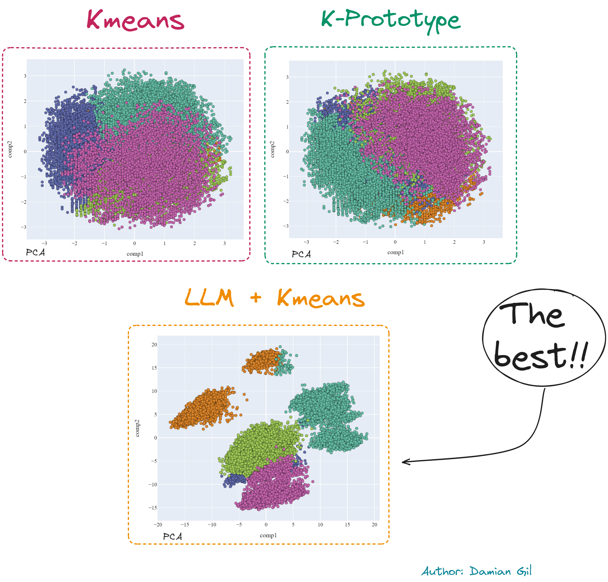
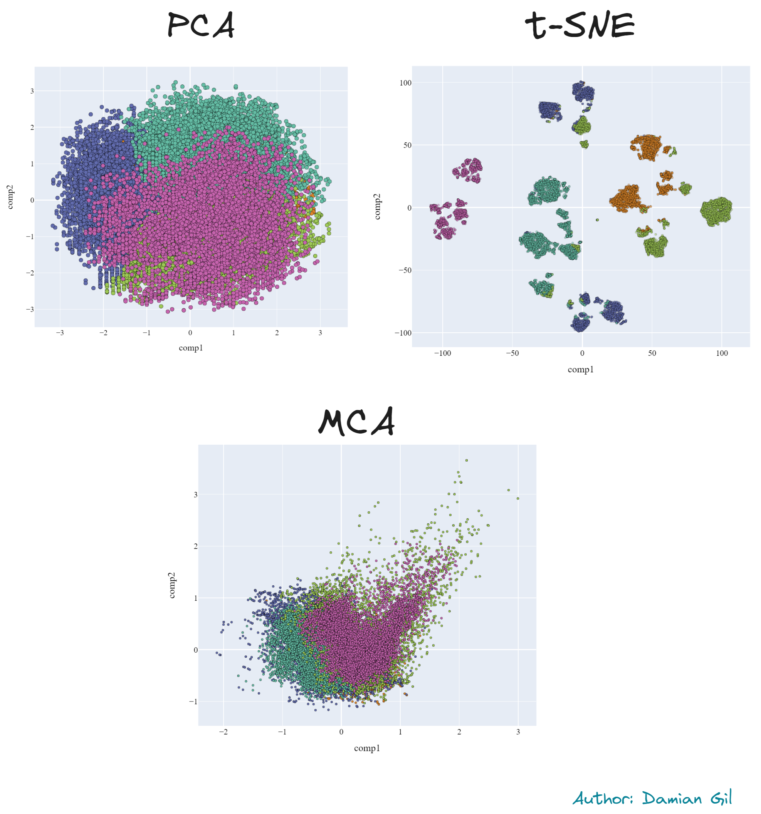

# Clustering with LLM

## Introduction

A customer segmentation project can be approached in multiple ways. In this repository, we will explore advanced techniques for defining clusters and analyzing the results. This repo is intended for data scientists looking to expand their toolbox for tackling clustering problems and advancing towards becoming senior data scientists.

### What Will We Cover?

In this repo, we will explore three methods to approach customer segmentation projects:

1. Kmeans
2. K-Prototype
3. LLM + Kmeans




As a preview, we will provide a comparison of 2D representations (PCA) of the different models created. Additionally, you will learn about dimensionality reduction techniques such as PCA, t-SNE, and MCA, with results included.




**Important Note**: This project does not cover the exploratory data analysis (EDA) phase or variable selection, which are crucial steps in such projects.

## Data

The original data used in this project is from a public Kaggle dataset called "Banking Dataset - Marketing Targets." Each row in this dataset contains information about a company's customers, including both numerical and categorical fields. This diversity in data types opens up various approaches to the problem.

For this project, we will focus on the first 8 columns of the dataset, which include:

- `age` (numeric)
- `job`: type of job (categorical)
- `marital`: marital status (categorical)
- `education`: education level (categorical)
- `default`: has credit in default? (binary)
- `balance`: average yearly balance in euros (numeric)
- `housing`: has a housing loan? (binary)
- `loan`: has a personal loan? (binary)

The project uses the training dataset from Kaggle, which can be found in the "data" folder of the project repository as a compressed file. Inside the compressed file, you'll find two CSV files: `train.csv` (the original training dataset) and `embedding_train.csv` (the dataset after performing an embedding, which will be explained later).

To understand the project's structure, here's an overview of the project directory:

```
clustering_llm
├─ data
│  ├─ data.rar
├─ img
├─ embedding.ipynb
├─ embedding_creation.py
├─ kmeans.ipynb
├─ kprototypes.ipynb
├─ README.md
└─ requirements.txt

```

## Method 1: Kmeans

Kmeans is a commonly used clustering method, and we will dive into it to demonstrate advanced analysis techniques. The complete procedure can be found in the Jupyter notebook titled `kmeans.ipynb`.

## Method 2: Kprototype
Method to create clusters when you have a mix of features (categorical and numerical). Jupyter notebook titled `kprototypes.ipynb`.

## Method 3: LLM + Kmeans
The jewel in the crown, where you will find how to apply llm to obtain impeccable results in cluttering projects Jupyter notebook titled `embedding.ipynb`.


